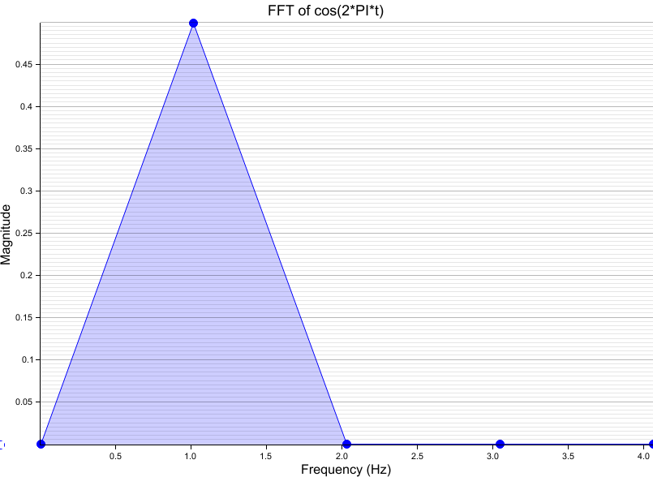

# Summary

This repository implements various numerical methods.

In Progress:
- FFT

Future:
- Root finding
- Interpolation
- Integration
- Gaussian
- Data fitting
- ODE

To use, first confirm all unit tests run:
```
cargo test
```
Then run the main function to also create images and provide console logs:
```
cargo run
```
Output images can be found within the img/ directory. Note that "reference_" images were captured from Excel, not produced through Rust.

# Components
## Fast Fourier Transform (FFT)
This function takes in a complex signal and performs an FFT on it.

Three functions exist in the unit tests:
- Step function with a magnitude of 1.0
- Cosine function with an angular frequency of 2 * PI
- Sine function with an angular frequency of 4 * PI

### Frequency of Signal

Angular frequency (_w_) = 2 * PI * frequency

For the step function, the angular frequency is 0, as it is a constant signal.

For the cosine function, the angular frequency is 2 * PI, so the frequency = (2 * PI) / (2 * PI) = 1. This indicates that the function operates at a frequency of 1 Hz.

For the sine function, the angular frequency is 4 * PI, so the frequency = 2 (i.e. 2 Hz).

### Magnitude of Complex Signal
Magnitude = sqrt( real^2 + imag^2 )

# Result images
Below are examples of images associated to unit test functions. Reference images are from a project I did in 2013 in Fortran with plotting in Excel.

| Function    | Fortran/Excel (reference)                                       | Rust                                                |
|-------------|-----------------------------------------------------------------|-----------------------------------------------------|
| Step        |    |  |
| Cos(2*PI*t) |  |  |
| Sin(4*PI*t) |  |  |
